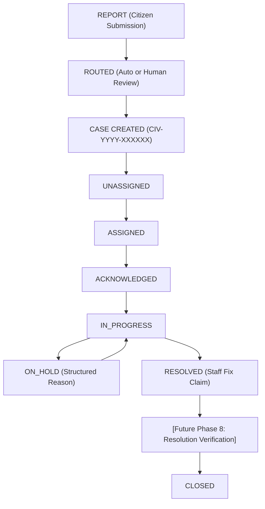

# CivicFlow Architecture Specification

## Overview

CivicFlow is built on the core product principle:
> **ONE CIVIC INCIDENT → ONE RESPONSIBLE CASE → ONE AUDITABLE JOURNEY**

- **Phase 1**: Authentication + Role-Based Access Control (RBAC)
- **Phase 2**: Citizen Civic Report Creation
- **Phase 3**: AI Issue Understanding Engine (Google Gemini)
- **Phase 4**: Geospatial + Dynamic Jurisdiction Engine (PostGIS + Temporal Versioning)

---

## 1. Architectural Separation: Understanding vs. Jurisdiction vs. Responsibility

```text
Citizen Report ──► [ Phase 3: AI Understanding (Gemini) ]    ──► WHAT is happening?
                                                                      │
                                                                      ▼
                   [ Phase 4: Geospatial Engine (PostGIS) ] ──► WHERE is it happening?
                                                                      │
                                                                      ▼
                   [ Phase 5: Responsibility Rules ]        ──► WHO is responsible?
```

> [!IMPORTANT]
> **Gemini is strictly restricted to understanding the problem.**
> It never decides whether MCC, a Town Panchayat, or a Gram Panchayat owns the issue.
> **Phase 4 is strictly restricted to resolving WHERE the problem is.**
> It never determines department ownership or responsibility rules (MCC vs. Panchayat legal ownership), which are resolved dynamically in Phase 5.

---

## 2. Phase 4: Geospatial & Temporal Jurisdiction Pipeline

```text
Civic Report [GPS Coordinates + Report Timestamp]
                      │
                      ▼
POSTGIS ST_Covers Spatial Query + Temporal Filter
WHERE ST_Covers(geometry, ST_SetSRID(ST_MakePoint(lng, lat), 4326))
  AND valid_from <= report_time
  AND (valid_until IS NULL OR report_time < valid_until)
                      │
                      ▼
       Match Cardinality Evaluation
       ├── Case A: Exactly 1 Match
       │     └── Status: MATCHED (requires_review: false)
       │
       ├── Case B: 0 Matches (Outside Boundaries or Temporal Gap)
       │     └── Status: NO_JURISDICTION_MATCH (requires_review: true)
       │
       └── Case C: >1 Matches (Overlapping Boundaries / Boundary Dispute)
             └── Status: JURISDICTION_CONFLICT (requires_review: true)
                      │
                      ▼
Immutable Historical Snapshot Recording
Persisted in `report_jurisdiction` table with exact timestamp and boundary version.
```

---

## 3. PostGIS and Jurisdiction Schemas

```sql
-- PostGIS Extension
CREATE EXTENSION IF NOT EXISTS postgis;

-- Administrative Jurisdictions (Identity)
CREATE TABLE jurisdictions (
    id UUID PRIMARY KEY DEFAULT gen_random_uuid(),
    code VARCHAR(50) UNIQUE NOT NULL,
    name VARCHAR(255) NOT NULL,
    type VARCHAR(50) NOT NULL CHECK (type IN ('MCC_WARD', 'TOWN_PANCHAYAT', 'GRAM_PANCHAYAT', 'SPECIAL_ZONE')),
    created_at TIMESTAMPTZ DEFAULT NOW(),
    updated_at TIMESTAMPTZ DEFAULT NOW()
);

-- Versioned Spatial Boundaries (Polygon Geometries + Temporal Window)
CREATE TABLE jurisdiction_boundaries (
    id UUID PRIMARY KEY DEFAULT gen_random_uuid(),
    jurisdiction_id UUID NOT NULL REFERENCES jurisdictions(id) ON DELETE CASCADE,
    version VARCHAR(50) NOT NULL,
    geometry GEOMETRY(Polygon, 4326) NOT NULL,
    valid_from TIMESTAMPTZ NOT NULL,
    valid_until TIMESTAMPTZ,
    metadata JSONB DEFAULT '{}'::jsonb,
    created_at TIMESTAMPTZ DEFAULT NOW(),
    updated_at TIMESTAMPTZ DEFAULT NOW()
);
CREATE INDEX idx_jurisdiction_boundaries_geom ON jurisdiction_boundaries USING GIST (geometry);
CREATE INDEX idx_jurisdiction_boundaries_temporal ON jurisdiction_boundaries (valid_from, valid_until);
CREATE INDEX idx_jurisdiction_boundaries_jur_version ON jurisdiction_boundaries (jurisdiction_id, version);

-- Immutable Historical Report Resolution Snapshot
CREATE TABLE report_jurisdiction (
    id UUID PRIMARY KEY DEFAULT gen_random_uuid(),
    report_id UUID NOT NULL REFERENCES reports(id) ON DELETE CASCADE,
    jurisdiction_id UUID REFERENCES jurisdictions(id),
    jurisdiction_boundary_id UUID REFERENCES jurisdiction_boundaries(id),
    matched_at TIMESTAMPTZ NOT NULL DEFAULT NOW(),
    report_time TIMESTAMPTZ NOT NULL,
    match_status VARCHAR(50) NOT NULL CHECK (match_status IN ('MATCHED', 'NO_JURISDICTION_MATCH', 'JURISDICTION_CONFLICT')),
    match_method VARCHAR(50) NOT NULL DEFAULT 'POSTGIS_POINT_IN_POLYGON',
    requires_review BOOLEAN NOT NULL DEFAULT false,
    candidate_matches JSONB DEFAULT '[]'::jsonb,
    created_at TIMESTAMPTZ DEFAULT NOW()
);
CREATE INDEX idx_report_jurisdiction_report_id ON report_jurisdiction (report_id);
```

---

## 4. Database Schema: AI Analysis (Phase 3)

```sql
CREATE TABLE report_ai_analysis (
    id UUID PRIMARY KEY DEFAULT gen_random_uuid(),
    report_id UUID NOT NULL REFERENCES reports(id) ON DELETE CASCADE,
    model VARCHAR(100) NOT NULL,
    category VARCHAR(50) NOT NULL CHECK (category IN (
        'POTHOLE',
        'BLOCKED_DRAIN',
        'GARBAGE_OVERFLOW',
        'BROKEN_STREETLIGHT',
        'ILLEGAL_DUMPING',
        'OTHER'
    )),
    severity VARCHAR(20) NOT NULL CHECK (severity IN ('LOW', 'MEDIUM', 'HIGH', 'CRITICAL')),
    summary TEXT NOT NULL,
    risk_factors JSONB NOT NULL DEFAULT '[]'::jsonb,
    confidence NUMERIC(4, 3) NOT NULL CHECK (confidence >= 0.0 AND confidence <= 1.0),
    status VARCHAR(30) NOT NULL CHECK (status IN ('PENDING', 'PROCESSING', 'COMPLETED', 'FAILED', 'NEEDS_REVIEW')),
    raw_version VARCHAR(50) NOT NULL DEFAULT 'v1',
    error_message TEXT,
    created_at TIMESTAMPTZ NOT NULL DEFAULT NOW(),
    updated_at TIMESTAMPTZ NOT NULL DEFAULT NOW()
);

CREATE INDEX idx_report_ai_analysis_report_id ON report_ai_analysis(report_id);
CREATE INDEX idx_report_ai_analysis_status ON report_ai_analysis(status);
```

---

## 5. Phase 5: Dynamic Civic Responsibility Rule Engine

### Core Pipeline

```text
Inputs:
1. Issue Category (from Phase 3 AI Analysis or Citizen Report Submission)
2. Administrative Jurisdiction (from Phase 4 PostGIS/Spatial resolution)
3. Report Timestamp (Temporal filter for policy versions)
4. AI Uncertainty Indicator (Status: NEEDS_REVIEW / Confidence < 0.70)
                      │
                      ▼
Versioned Responsibility Rules Evaluation
WHERE rr.active = true
  AND rr.issue_category = :category
  AND (rr.jurisdiction_id = :jurisdiction_id OR rr.jurisdiction_id IS NULL)
  AND rr.valid_from <= :report_time
  AND (rr.valid_until IS NULL OR :report_time < rr.valid_until)
ORDER BY rr.priority DESC, rr.created_at ASC
                      │
                      ▼
        Match Evaluation & Cardinality
        ├── Case A: Exactly 1 Winner Rule (and AI is confident)
        │     └── Status: ROUTED (requires_review: false)
        │         Assigns: Authority + Department + Policy Rule Version
        │
        ├── Case B: 0 Matching Rules (Unmapped Problem or Jurisdiction)
        │     └── Status: NO_RESPONSIBLE_RULE (requires_review: true)
        │         Refuses arbitrary fallback; flags for administrative policy allocation
        │
        ├── Case C: Multiple Rules with Identical Top Priority
        │     └── Status: RESPONSIBILITY_CONFLICT (requires_review: true)
        │         Lists all competing candidate rules and authorities
        │
        └── Case D: AI Uncertainty (AI marked NEEDS_REVIEW or Confidence < 70%)
              └── Status: NEEDS_REVIEW (requires_review: true)
                  Provisional route assigned with human-review advisory prior to dispatch
                      │
                      ▼
Immutable Historical Routing Snapshot
Persisted in `report_routing` table with full explainability trace:
WHAT • WHERE • WHICH VERSION • WHO • DEPARTMENT • WHY
```

### Phase 5 Database Schemas

```sql
-- Authorities (Civic Bodies / Legal Entities)
CREATE TABLE authorities (
    id UUID PRIMARY KEY DEFAULT gen_random_uuid(),
    code VARCHAR(50) UNIQUE NOT NULL,
    name VARCHAR(255) NOT NULL,
    type VARCHAR(50) NOT NULL CHECK (type IN (
        'MUNICIPAL_CORPORATION',
        'TOWN_PANCHAYAT',
        'GRAM_PANCHAYAT',
        'UTILITY_BOARD',
        'SPECIAL_AUTHORITY'
    )),
    created_at TIMESTAMPTZ DEFAULT NOW(),
    updated_at TIMESTAMPTZ DEFAULT NOW()
);
CREATE INDEX idx_authorities_code ON authorities (code);

-- Departments (Operational Wings within an Authority)
CREATE TABLE departments (
    id UUID PRIMARY KEY DEFAULT gen_random_uuid(),
    authority_id UUID NOT NULL REFERENCES authorities(id) ON DELETE CASCADE,
    code VARCHAR(50) NOT NULL,
    name VARCHAR(255) NOT NULL,
    description TEXT,
    created_at TIMESTAMPTZ DEFAULT NOW(),
    updated_at TIMESTAMPTZ DEFAULT NOW(),
    CONSTRAINT uq_authority_department UNIQUE (authority_id, code)
);
CREATE INDEX idx_departments_authority ON departments (authority_id);
CREATE INDEX idx_departments_code ON departments (code);

-- Responsibility Rules (Data-Driven Civic Jurisdiction Policies)
CREATE TABLE responsibility_rules (
    id UUID PRIMARY KEY DEFAULT gen_random_uuid(),
    jurisdiction_id UUID REFERENCES jurisdictions(id) ON DELETE CASCADE,
    jurisdiction_type VARCHAR(50),
    issue_category VARCHAR(50) NOT NULL CHECK (issue_category IN (
        'POTHOLE',
        'BLOCKED_DRAIN',
        'GARBAGE_OVERFLOW',
        'BROKEN_STREETLIGHT',
        'ILLEGAL_DUMPING',
        'OTHER'
    )),
    authority_id UUID NOT NULL REFERENCES authorities(id) ON DELETE RESTRICT,
    department_id UUID NOT NULL REFERENCES departments(id) ON DELETE RESTRICT,
    version VARCHAR(50) NOT NULL,
    valid_from TIMESTAMPTZ NOT NULL,
    valid_until TIMESTAMPTZ,
    priority INTEGER NOT NULL DEFAULT 100,
    active BOOLEAN NOT NULL DEFAULT true,
    metadata JSONB DEFAULT '{}'::jsonb,
    created_at TIMESTAMPTZ DEFAULT NOW(),
    updated_at TIMESTAMPTZ DEFAULT NOW()
);
CREATE INDEX idx_resp_rules_lookup ON responsibility_rules (jurisdiction_id, issue_category, valid_from, valid_until);
CREATE INDEX idx_resp_rules_active ON responsibility_rules (active);
CREATE INDEX idx_resp_rules_version ON responsibility_rules (version);

-- Immutable Report Routing Audit Snapshots
CREATE TABLE report_routing (
    id UUID PRIMARY KEY DEFAULT gen_random_uuid(),
    report_id UUID NOT NULL REFERENCES reports(id) ON DELETE CASCADE,
    jurisdiction_id UUID REFERENCES jurisdictions(id),
    jurisdiction_boundary_id UUID REFERENCES jurisdiction_boundaries(id),
    responsibility_rule_id UUID REFERENCES responsibility_rules(id),
    authority_id UUID REFERENCES authorities(id),
    department_id UUID REFERENCES departments(id),
    issue_category_used VARCHAR(50) NOT NULL,
    category_source VARCHAR(50) NOT NULL DEFAULT 'REPORT_SUBMISSION' CHECK (category_source IN (
        'REPORT_SUBMISSION',
        'AI_ANALYSIS',
        'MANUAL_OVERRIDE'
    )),
    route_status VARCHAR(50) NOT NULL CHECK (route_status IN (
        'ROUTED',
        'NO_RESPONSIBLE_RULE',
        'RESPONSIBILITY_CONFLICT',
        'NEEDS_REVIEW'
    )),
    match_method VARCHAR(50) NOT NULL DEFAULT 'DETERMINISTIC_RULE_MATCH',
    requires_review BOOLEAN NOT NULL DEFAULT false,
    candidate_rules JSONB DEFAULT '[]'::jsonb,
    explanation TEXT NOT NULL,
    routed_at TIMESTAMPTZ NOT NULL DEFAULT NOW(),
    created_at TIMESTAMPTZ DEFAULT NOW(),
    -- Phase 6 Extensions
    routing_status VARCHAR(50) NOT NULL DEFAULT 'PENDING' CHECK (routing_status IN (
        'PENDING',
        'AUTO_ROUTED',
        'NEEDS_REVIEW',
        'REVIEWED',
        'ROUTING_FAILED'
    )),
    review_reasons JSONB DEFAULT '[]'::jsonb,
    decision_source VARCHAR(50) NOT NULL DEFAULT 'AUTOMATIC' CHECK (decision_source IN (
        'AUTOMATIC',
        'HUMAN_REVIEW'
    )),
    reviewed_by UUID REFERENCES users(id),
    reviewed_at TIMESTAMPTZ,
    review_notes TEXT,
    final_authority_id UUID REFERENCES authorities(id),
    final_department_id UUID REFERENCES departments(id)
);
CREATE INDEX idx_report_routing_report_id ON report_routing (report_id);
CREATE INDEX idx_report_routing_status ON report_routing (route_status);
CREATE INDEX idx_report_routing_routing_status ON report_routing (routing_status);
CREATE INDEX idx_report_routing_decision_source ON report_routing (decision_source);
CREATE INDEX idx_report_routing_routed_at ON report_routing (routed_at);

-- Phase 6: Human Routing Review Audit Log Table
CREATE TABLE routing_reviews (
    id UUID PRIMARY KEY DEFAULT gen_random_uuid(),
    report_id UUID NOT NULL REFERENCES reports(id) ON DELETE CASCADE,
    routing_id UUID NOT NULL REFERENCES report_routing(id) ON DELETE CASCADE,
    action VARCHAR(50) NOT NULL CHECK (action IN ('APPROVE', 'OVERRIDE')),
    original_authority_id UUID REFERENCES authorities(id),
    original_department_id UUID REFERENCES departments(id),
    final_authority_id UUID NOT NULL REFERENCES authorities(id),
    final_department_id UUID NOT NULL REFERENCES departments(id),
    reviewed_by UUID NOT NULL REFERENCES users(id),
    review_notes TEXT,
    created_at TIMESTAMPTZ NOT NULL DEFAULT NOW()
);
CREATE INDEX idx_routing_reviews_report ON routing_reviews (report_id);
CREATE INDEX idx_routing_reviews_reviewer ON routing_reviews (reviewed_by);
CREATE INDEX idx_routing_reviews_created ON routing_reviews (created_at);
```

---

## 5. Phase 6: Routing Confidence & Human Review System

### Core Architectural Principle
> **AUTOMATE WHEN CONFIDENT. ESCALATE WHEN UNCERTAIN. NEVER GUESS RESPONSIBILITY.**

The system introduces a deterministic decision layer between the rule engine outputs and final case routing. It knows when automated dispatch is safe and when human review is required.

### Conceptual Flow

```text
       AI Analysis
            |
            v
       Jurisdiction
            |
            v
   Responsibility Rule
            |
            v
   Routing Assessment
      /          \
     /            \
AUTO-ROUTED    NEEDS-REVIEW
                    |
                    v
              Human Review
               /       \
              /         \
         Approve       Override
              \         /
               \       /
                Final Route
```

### 1. Routing State Model

- `PENDING`: Routing evaluation has not completed yet.
- `AUTO_ROUTED`: All required signals are resolved with high certainty and zero conflicts.
- `NEEDS_REVIEW`: System detected uncertainty, spatial ambiguity, or unmapped rules; held for human review.
- `REVIEWED`: Staff or administrator has adjudicated the route via explicit approval or override.
- `ROUTING_FAILED`: An unexpected technical error occurred during evaluation (stack trace logged internally).

### 2. Structured Review Reasons (Controlled Structure)

Arbitrary client strings are never accepted as review reasons. The backend strictly evaluates:
- `AI_LOW_CONFIDENCE`: Gemini issue understanding confidence is below the configured threshold (<0.70).
- `AI_NEEDS_REVIEW`: Gemini flagged the problem description as ambiguous or unclassifiable.
- `NO_JURISDICTION_MATCH`: GPS coordinates fall outside mapped municipal administrative boundaries.
- `JURISDICTION_CONFLICT`: Point intersects multiple overlapping boundary polygons (boundary dispute).
- `NO_RESPONSIBILITY_RULE`: No active rule in `responsibility_rules` maps this issue category in this jurisdiction.
- `RESPONSIBILITY_CONFLICT`: Multiple competing responsibility rules match with equal priority.
- `INVALID_LOCATION`: Coordinates are missing, incomplete, or marked unverified.
- `INCOMPLETE_REPORT`: Missing problem description or required input attributes.
- `ROUTING_DATA_ERROR`: Technical or schema error during evaluation.
- `UNKNOWN`: Unclassified review state.

### 3. Automatic Routing Criteria vs Mandatory Review Conditions

A case is **AUTO_ROUTED** if and only if **all** of the following conditions hold:
1. Valid category and complete report inputs.
2. AI confidence $\ge 0.70$ and AI status $\ne$ `NEEDS_REVIEW`.
3. Exactly one spatial jurisdiction match (`MATCHED`).
4. Exactly one active responsibility rule match (`ROUTED`).

If **any** hard review condition is triggered (`JURISDICTION_CONFLICT`, `NO_JURISDICTION_MATCH`, `NO_RESPONSIBILITY_RULE`, `RESPONSIBILITY_CONFLICT`, `AI_LOW_CONFIDENCE`), the result is forced to **NEEDS_REVIEW** regardless of AI confidence. A 0.99 AI confidence score will never override a spatial boundary dispute.

### 4. Human Review & Override Immutability

- **Approve Suggested Route**: Staff confirms the candidate route identified by the rule engine. The original route is retained, and `decision_source` is updated to `HUMAN_REVIEW`.
- **Override Route**: Staff assigns a different authority and department. Both the original automatic decision and the human override are recorded in `routing_reviews`. History is **never** mutated or erased.
- **Idempotency**: Consecutive submissions are protected against double-clicking or network retries. Once adjudicated, reports leave the unresolved review queue.

### 5. Security & RBAC Model

- `CITIZEN`: Strict 403 Forbidden on review queue retrieval (`GET /api/staff/routing-review`) and review actions (`POST /api/reports/:id/routing-review`).
- `STAFF` & `ADMIN`: Authorized to view the review queue and perform route adjudications.
- **Reviewer Identity**: Derived strictly from verified backend JWT session (`req.user.id`). Client-supplied reviewer IDs are rejected.

---

## 5. Phase 7: Staff Case Workflow & Accountability Lifecycle

### Core Architectural Principle
> **ROUTING IS NOT THE END.**
> A civic issue must transition from:
> `routed ──► acknowledged ──► in progress ──► resolved`
> Every important state transition must be auditable, immutable, and accountable.



### 1. Report vs. Case Separation
- **REPORT (`reports` table)**: The citizen's immutable submission containing citizen descriptions, media attachments, raw GPS coordinates, and user identity.
- **CASE (`civic_cases` table)**: The operational civic-work item created from the report after routing. It manages operational workflow, department routing, staff ownership, execution timestamps, and lifecycle transitions (1:1 relationship with `reports`).

### 2. Human-Friendly Case Identifier
Case numbers follow the standard format:
`CIV-YYYY-XXXXXX` (e.g., `CIV-2026-010001`)
Sequential database IDs are never exposed as the primary operational case reference.

### 3. Case Lifecycle & Controlled State Transitions
Civic cases follow a strict backend-enforced state machine:

| From Status | Allowed To Status | Preconditions / Requirements |
| :--- | :--- | :--- |
| `UNASSIGNED` | `ASSIGNED` | Staff user assigned from authorized authority/department |
| `ASSIGNED` | `ACKNOWLEDGED` | Assigned staff member confirms receipt |
| `ASSIGNED` | `ASSIGNED` | Reassignment to another staff member (logged in audit trail) |
| `ACKNOWLEDGED` | `IN_PROGRESS` | Work execution commenced (`started_at` recorded) |
| `ACKNOWLEDGED` | `ASSIGNED` | Reassignment if needed |
| `IN_PROGRESS` | `ON_HOLD` | Mandatory structured reason (`WAITING_FOR_MATERIAL`, `WEATHER`, `ACCESS_BLOCKED`, `REQUIRES_EXTERNAL_TEAM`, `OTHER`) |
| `IN_PROGRESS` | `RESOLVED` | Mandatory resolution note detailing the fix performed |
| `ON_HOLD` | `IN_PROGRESS` | Resumption of active maintenance |
| `RESOLVED` | `CLOSED` | Operational workflow completed (pending Phase 8 verification) |

**Prohibited Transitions (Server-Enforced):**
- `ASSIGNED ──► RESOLVED`: Strict 400 Bad Request (work must be acknowledged and started).
- `RESOLVED ──► IN_PROGRESS`: Strict 400 Bad Request (re-opening requires formal review).
- `UNASSIGNED ──► RESOLVED`: Strict 400 Bad Request.

### 4. Why RESOLVED is NOT Equivalent to VERIFIED
In Phase 7:
> **RESOLVED means "Staff claims the work is complete."**
> It does **NOT** mean the system or citizen has independently verified the fix.
Independent AI image verification, sensor telemetry, and citizen dispute confirmation will be implemented in Phase 8. The system does not automatically set `CLOSED` or claim absolute physical resolution.

### 5. Immutable Case Event Audit Trail (`case_events`)
Every operational transition creates an append-only event record:
- `id`: UUIDv4
- `case_id`: Reference to `civic_cases.id`
- `event_type`: `CASE_CREATED`, `CASE_ASSIGNED`, `CASE_REASSIGNED`, `CASE_ACKNOWLEDGED`, `CASE_STARTED`, `CASE_ON_HOLD`, `CASE_RESUMED`, `CASE_NOTE_ADDED`, `CASE_RESOLVED`, `CASE_CLOSED`
- `from_status`, `to_status`: Lifecycle state deltas
- `actor_user_id`: Server-derived ID of acting staff/admin
- `note`: Operational note or resolution explanation
- `metadata`: Structured payloads (e.g., hold reasons, assignment changes, citizen visibility)
- `created_at`: Server-assigned UTC timestamp

History is **never** mutated or deleted. Corrections create new chronological events.

### 6. Staff Authorization & Department Scoping
- Only users with `role: 'STAFF'` or `'ADMIN'` can access staff queues or execute case state transitions.
- A staff member's department and authority membership (`authority_id`, `department_id`) are checked against the case's assigned operating unit. Cross-department actions (e.g., a drainage officer attempting to reassign or resolve a road case) are blocked with `403 Forbidden`.
- Identity and permissions are derived strictly server-side from authenticated sessions.

### 7. Citizen Visibility & Transparency
Citizens can view their report's operational journey via `GET /api/reports/:id/case`:
- Displays a 5-stage progress indicator:
  `Report Received ──► Routed to Department ──► Staff Acknowledged ──► Work In Progress ──► Resolved`
- Sanitized timeline shows operational progress without leaking internal administrative metadata or private internal staff notes (`metadata.is_internal = true`).
- Citizens have read-only access (403 Forbidden on write operations).

### 8. Case Creation: Auto-Routing & Human Review Flow
- **AUTO_ROUTED**: Automatically triggers idempotent operational case creation (`createCaseForReport`).
- **NEEDS_REVIEW**: No operational case is assigned while under review. When staff approves or overrides the route (`POST /api/reports/:id/routing-review`), an operational case is atomically generated in `UNASSIGNED` state.
- **Idempotency**: Unique constraint on `report_id` prevents duplicate cases on retries.

### 9. Transaction & Concurrency Safety
- Status updates and event logging execute within transactional boundaries (`BEGIN ... COMMIT / ROLLBACK`).
- If event persistence fails, status changes are rolled back to prevent inconsistent states.
- Duplicate status requests (e.g., double-clicking buttons) are handled idempotently without emitting redundant events.

